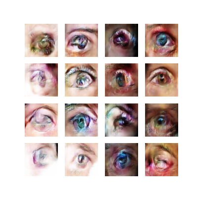
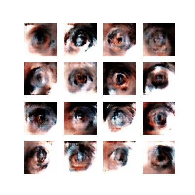
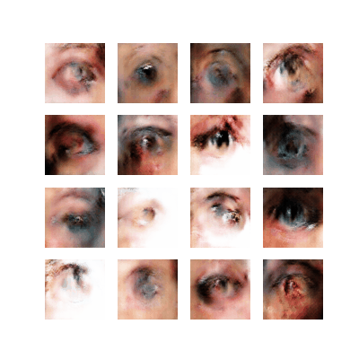

# EyeGAN

Generating human eyes with a DCGAN

## Requirements
- Tensorflow
- Numpy
- Python 3

## Getting Started
eye dataset is the eyes (copy) folder. Around 1000 human and a few non-human eyes.

Run main.py to begin training.

## Data
Using the images from this [simliar project](https://github.com/aaaa-trsh/Eye-DCGAN/)
and [bulk bing image downloader](https://github.com/ostrolucky/Bulk-Bing-Image-downloader),
I was able to amass around 1000 images of eyes. Using tensorflow to reflect each image horizontally, the dataset was augmented to ~200 images.

## Results
*Note the ordering of the images are incorrect for the black and white images. 
I made an error naming the files. The epoch is incorrect.

